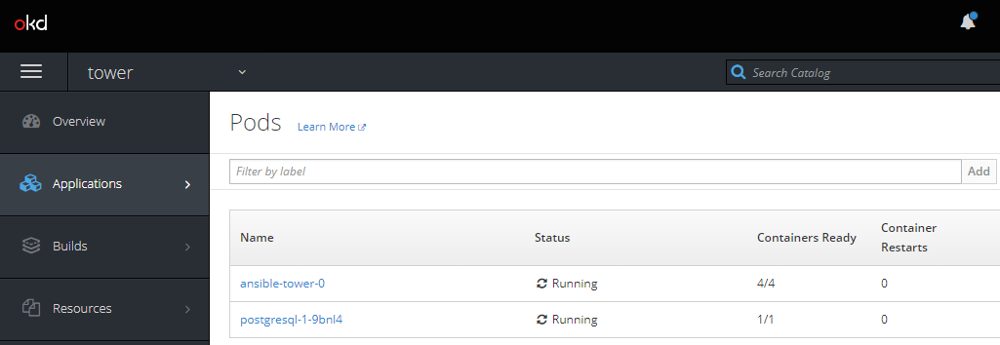

# Setup Ansible Tower on Openshift

https://developers.redhat.com/blog/2018/10/26/installing-and-managing-ansible-tower-on-red-hat-openshift-container-platform/

## Prerequisites

- OpenShift cluster

## Setup instructions

1. Login to your OpenShift cluster
    ```
    $ oc login https://myURL:443 -u myUser -p myPassword
    ```

1. Create persitent volume claim. Thefore, copy this snippet in a file called `postgres-nfs-pvc.yml` or take the file from this repository.
    ```
    apiVersion: v1
    kind: PersistentVolumeClaim
    metadata:
      name: postgresql
    spec:
      accessModes:
        - ReadWriteOnce
      resources:
        requests:
          storage: 10Gi
    ```

1.  Create the PVC in OpenShift
    ```
    $ oc create -f postgres-nfs-pvc.yml
    ```

1. Download the installer for Ansible Tower on OpenShift and extract it.

    ```
    $ wget https://releases.ansible.com/ansible-tower/setup_openshift/ansible-tower-openshift-setup-3.3.1.tar.gz
    $ tar -xzvf ansible-tower-openshift-setup-3.3.1.tar.gz
    $ cd ansible-tower-openshift-setup-3.3.1/
    ```

1. Change the values in the `inventory` file.
    ```
    # This will create or update a default admin (superuser) account in Tower
    admin_user='admin'
    admin_password='myPassword'

    # Tower Secret key
    # It's *very* important that this stay the same between upgrades or you will lose
    # the ability to decrypt your credentials
    secret_key='topsecret'

    # Database Settings
    # =================

    # Set pg_hostname if you have an external postgres server, otherwise
    # a new postgres service will be created
    # pg_hostname=postgresql

    # If using an external database, provide your existing credentials.
    # If you choose to use the provided containerized Postgres depolyment, these
    # values will be used when provisioning the database.
    pg_username='postgresuser'
    pg_password='postgrespwd'
    pg_database='tower'
    pg_port=5432

    rabbitmq_password='rabbitpwd'
    rabbitmq_erlang_cookie='rabitterlangpwd'

    # Note: The user running this installer will need cluster-admin privileges.
    # Tower's job execution container requires running in privileged mode,
    # and a service account must be created for auto peer-discovery to work.

    # Deploy into Openshift
    # =====================

    openshift_host='https://myOpenShiftClusterUrl:443'
    openshift_skip_tls_verify=true
    openshift_project='tower'
    openshift_user='admin'
    openshift_password='myPassword'
    # If you don't want to hardcode a password here, just do:
    # ./setup_openshift.sh -e openshift_token=$TOKEN
    ```

1. Start the installer
    ```
    $ ./setup_openshift.sh
    ``` 

1. The script will a couple of minutes to finish and this is the outcome once finished: 
    


